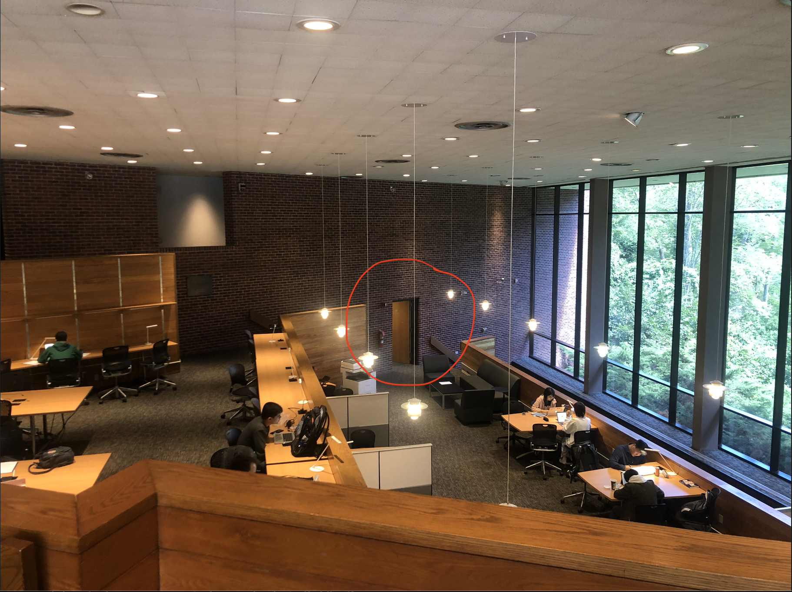

---
output:
  slidy_presentation: default
  html_document: default
  ioslides_presentation: default
  beamer_presentation: default
---

## Econ 184b, Econometrics, Fall 2021	
### Module 0: Kickstarter

## 
Xinde "James" Ji    

Department of Economics, Brandeis Univeristy

xji@brandeis.edu

Office: Sachar 001A

Office hours: Wednesday 2:00-5:00 pm

## Here's where my office is:

{height=400px}

## 
To better know you guys, please fill out this survey: 

https://xji.typeform.com/to/YjjxPBwn

I'll share my answers with you shortly

## 
* Xinde "James" Ji
* James / Professor Ji, he/him/his
* I speak Chinese (Mandarin, Shanghainese) and English
* I'm currently with my wife Sophia, and our 2-month-old daughter Reilly

##
{height=450px}

## 
* Game of Thrones / A Song of Ice and Fire - George RR Martin
* River Town - Peter Hessler
* Expecting Better - Emily Oster

## Here are two truths and a lie about me:
* I can recite $\pi$ to ~60 digits. 
* I completed 1-12 grades in 10 years
* I can stand upside down and split out jellybeans

## Why econometrics?
* ECON 80a teaches us about individual and firm behaviors
  - Adam Smith's invisible hands
* ECON 82b teaches us about how the macro-economy works
  - Keynes, Friedman, rational expectation
* Why is econometrics a required course for the ECON major?
  - Is it there to trick you folks?

## Economics as a science
* "If you ask 10 economists about their forecasts for next year, there will be 12 different answers."
* And economics was partly like astrology: make up some theory about how the world works, and be done with it
  - Adam Smith: The invisible hand always adjusts
  - Karl Marx: Price has to fluctuate around the cost of material/labor inputs
  - Malthus: We will run out of food because land grows arithmatically, and population grows exponentially
  
## Economics as a science
* What makes a discipline science?

## 
{height=450px}

## 
{height=450px}

## Modern Physics
{height=450px}

## 
{height=450px}

## And now we know that

$$h = \frac{1}{2}gt^2$$

with the **assumption** that there is no air resistance. 

(Of course, air resistance is also something that Newtonian mechanics can model.)

## Galileo's experiment
* Hypothesis: ligher ball falls as fast as heavier balls
* Experiment: drop two balls from the Pisa tower
* Data: time used with different initial heights
* Model: the free-fall equation
* Insights: the parameter *g* (the gravity constant)

## Now, what is econometrics, again?
* Econometrics is the scientific process of economics
* Uses data to test hypothesis, generate insights

## 

**Question**: How much is the return to education? Does that cover the actual/opportunity cost of going to college?

**Theory**: 

* Education provides useful knowledge and skills, thus increasing later-life wages (the human capital hypothesis)
* More schooling is a signal for innate ability, as workers with higher ability find schoolwork easier (the signaling hypothesis) 
* Individuals pays for college tuition, and forego ~4 years of wages by attending college

**Now we do what?**

## Data on schooling and wage earnings
{height=450px}

## 
{height=400px}

## 
* Wage positively correlated with schooling
* One additional year of schooling increases hourly wage by ~10%
  - Figured out using "regression"
* What could be wrong with this relationship?

## What could be wrong?
* What about innate ability? 
  - Education could just be a signal rather than bringing actual gains in human capital
* Correlation != Causation
  - And that's where econometrics differ (a bit) from statistics and data analytics
* Ed Leamer(1983)'s critique
  - Traditional econometric models are not *trustworthy*
  - "Hardly anyone takes data analysis seriously

## 
{height=350px}

## 
{height=350px}

## The credibility revolution
* That is where conometrics diverges traditional statistics/machine learning
   - Instrumental variables
   - Panel models
   - Quasi-experimental approach
   - Randomized control trials (RCT)

## And it is not just economics
Yiqing Xu, Professor of Political Science at Stanford University:

"The field of political science has been modernized in the recent years by borrowing from economics - not only information asymetry, transaction cost ... But also the quantitative methods in econometrics."

## And in other fields
* Public health
* History
  - Quantitative history
* Tech firms
  - AB tests
  
## A roadmap of what we will be doing
* Theory and intuition of econometric tools
  - Bivariate/multivariate regression
  - Hypothesis testing
  - IV, Panel data, quasi-experiments
* Implementation of these tools
* Use these tools to evaluate real-world questions
